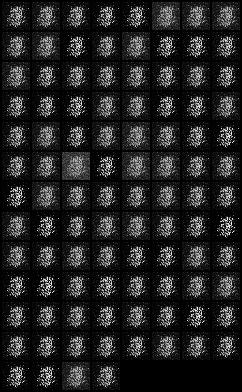
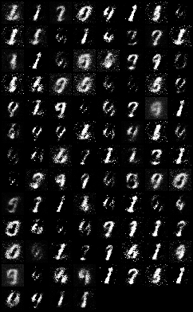
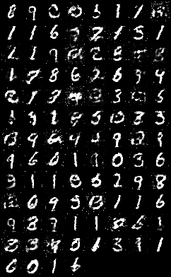
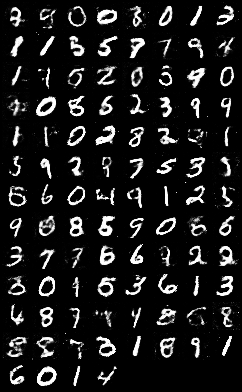
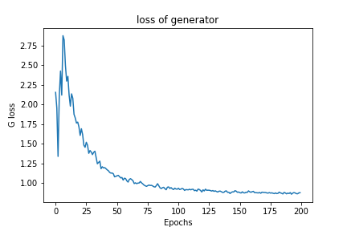
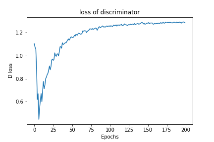
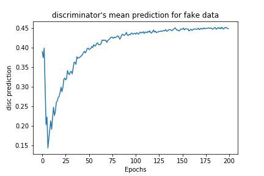
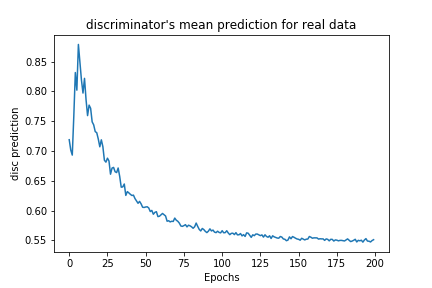

# GANs_on_MNIST_Torch
Generative Adversarial Networks on MNIST database using PyTorch.

# Dataset
MNIST : Handwritten Digits.

# Results

## Generated Images Through Training

Epoch 1           |  Epoch 10
:-------------------------:|:-------------------------:
  |  

Epoch  50           |  Epoch 200
:-------------------------:|:-------------------------:
  |  

## Discrimnator and Generator losses

Generator           |  Discriminator
:-------------------------:|:-------------------------:
  |  

## Dicriminator's mean prediction on real and on generated data

Real Images           |  Fake Images
:-------------------------:|:-------------------------:
  |  

